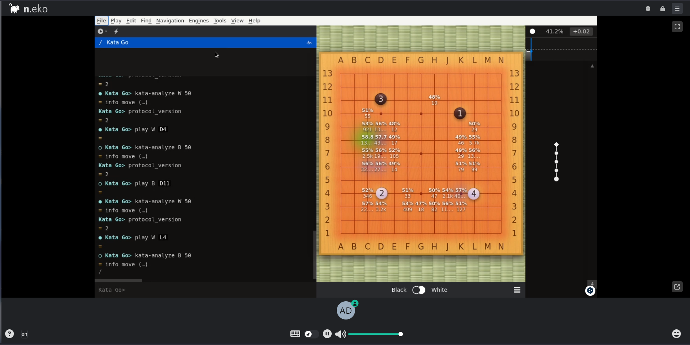
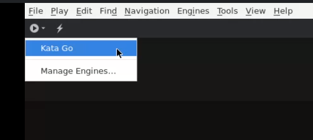
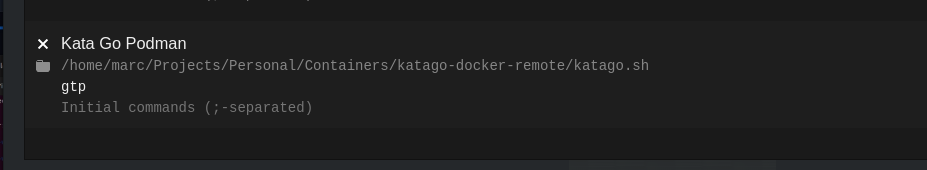

# Sabaki+KataGo on SSH or Neko

Sabaki is a Go/Baduk front-end written in Electron. KataGo is a ML model used play against human. KataGo implements Monte Carlo tree search with a convolutional neural network, like AlphaGo.

**Team Name: Darkness4 (organizer)**



## How-to-use

### With Neko

Using with Neko is the easiest.

Just submit the job:

```shell
dps submit -w -e --no-ts --job-name katago --credits 10000 ./job.katago.yaml
```

A bore URL will appear, just connect to it (credentials: user: `admin` and p: `neko`.

You can start the engine by opening the Engines Sidebar (Engines > Show Engines Sidebar).



Then, you can toggle the Analysis mode with <kbd>F4</kbd>.

### With SSH

1. Edit the job, and replace the SSH public key.

2. You need to start Sabaki locally.

3. Then, you can submit the job:

   ```shell
   dps submit -w -e --no-ts --job-name katago --credits 10000 ./job.yaml
   ```

   The user ID and bore URL will appear. This is the URL to the SSH server. You need to use the TCP one.

4. Write a script on your computer to connect to the server via SSH and launch katago with Sabaki:

   **/projects/katago/script**

   ```shell
   #!/bin/sh
   set -e
   
   SCRIPTPATH="$(dirname "$(realpath "$0")")"
   
   # Copy config file to remote server
   scp -P <port> "$SCRIPTPATH/default_gtp.cfg" <user>@bore.deepsquare.run:/tmp/default_gtp.cfg
   
   ssh -p <port> <user>@bore.deepsquare.run "set -e
   
   # Change this if you want to use an another model, see https://katagotraining.org
   RELEASE=kata1-b18c384nbt-s8493331456-d3920571699
   
   if [ ! -f \$DEEPSQUARE_DISK_TMP/default_model.bin.gz ]; then
     curl -fsSL https://media.katagotraining.org/uploaded/networks/models/kata1/\$RELEASE.bin.gz -o \$DEEPSQUARE_DISK_TMP/default_model.bin.gz
   fi
   
   /app/katago $@ -model \$DEEPSQUARE_DISK_TMP/default_model.bin.gz -config /tmp/default_gtp.cfg"
   
   ```

   Replace `<user>` and `<port>` with the user ID and bore port.

5. Add an Engine from the Engines Sidebar (Engines > Show Engines Sidebar) with:

   Path: The path to the script (`/projects/katago/script`)

   Arguments: `gtp`

   

6. Then start the engine:

   

7. Finally, you can toggle the Analysis mode with <kbd>F4</kbd>.
